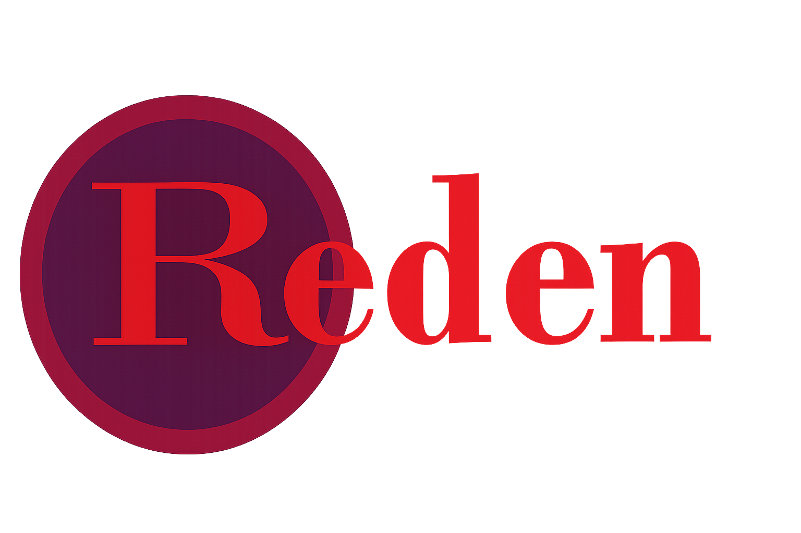

# 💬Reden

## 📘Descrição do projeto

Este projeto é fruto de um desafio de front_end da empresa júnio Knex. Neste, foi necessário utilizar React para criar um projeto CRUD que simula-se uma rede social. Dessa forma, o reden tem a capacidade de ver postagens de outros usuário, ver o usuário "logado", além de: adicionar novos posts e editar, deletar posts.
